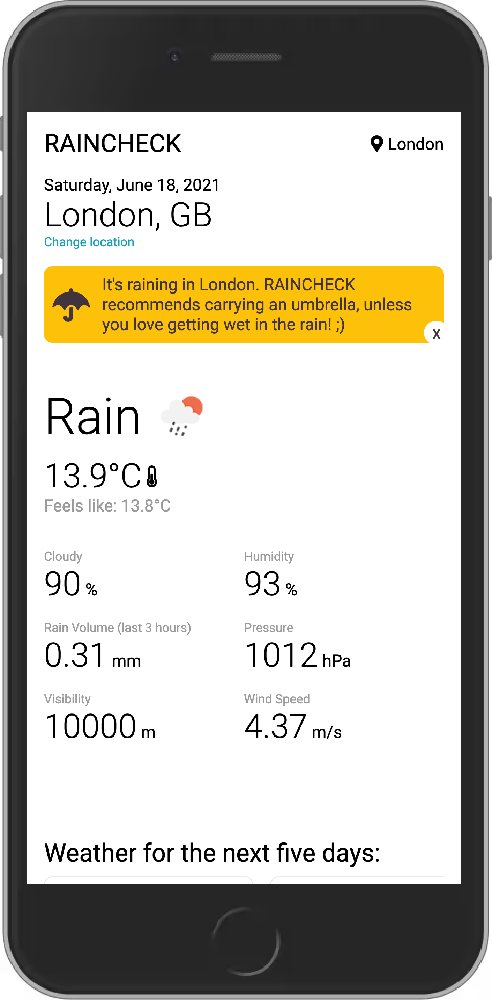
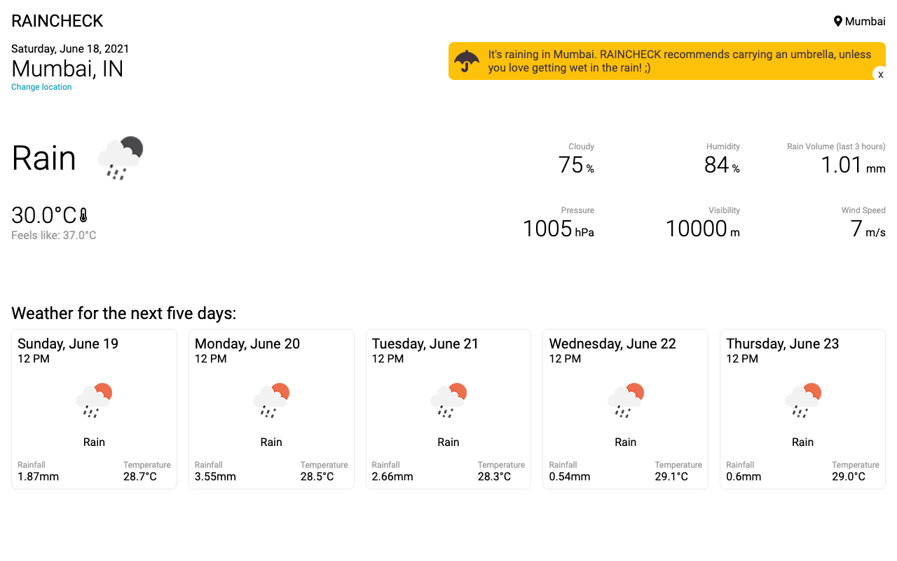

# RAINCHECK - Your friendly weather application

Dictionary states that,

<i>rain check</i>
 
noun NORTH AMERICAN
 
noun: raincheck
1. a ticket given for later use when a sporting fixture or other outdoor event is interrupted or postponed by rain.

The official RAINCHECK application helps you achieve that and much more with a simple weather check for any city on the planet. By default, the application will show you the weather for Mumbai. RAINCHECK gives you the latest temperature for the day and the weather over the next 5 days.

 
 

### Mobile View:

 
 

### Desktop View:

 
 

 

## Usage
### For non-developers:
Simply go to [RainCheck](https://raincheck-b5a57.web.app/) on your laptop, desktop, mobile, or all of them together, if you feel like.

 

### For developers:
If you are a developer and if you want to check the code, kindly check the section <b>Steps to run this project on your machine</b>. The entire project has been created using ReactJS, and it is hosted on Firebase.
 
Before you begin, make sure your machine is compatible. You need to have the following pre-requisites:

- NodeJS
- A stable internet connection
- An IDE (Visual Studio Code, preferable)

#### Steps to run this project on your machine

- Clone or fork this project on a specific location on your machine.
- Open your terminal and move to the folder where you have hosted your project.
- Run `npm install` and it will automatically install all the requirements and dependency for your project.
- Once all the dependencies have been installed, type `npm run start` and the application will open on your browser.